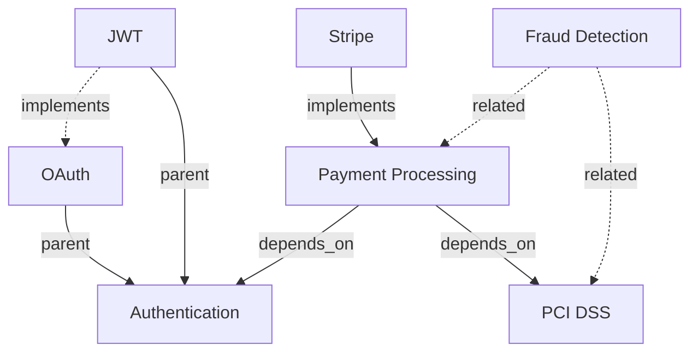

# Concept Relationship Types

**Version:** 1.0.0
**Status:** Draft

## Overview

Five relationship types define how concepts connect in the knowledge graph.

## Relationship Types

### parent

**Description:** Hierarchical parent-child relationship

**Semantics:** `A parent B` means "A is a type/category of B"

**Direction:** Child → Parent (upward in hierarchy)

**Examples:**
```yaml
- from: concept:@cpt_oauth
  to: concept:@cpt_authentication
  kind: parent
  # "OAuth is a type of Authentication"

- from: concept:@cpt_jwt
  to: concept:@cpt_authentication
  kind: parent
  # "JWT is a type of Authentication"

- from: concept:@cpt_stripe
  to: concept:@cpt_payment_gateway
  kind: parent
  # "Stripe is a type of Payment Gateway"
```

**Use Cases:**
- Taxonomy hierarchies
- IS-A relationships
- Category membership
- Inheritance structures

---

### related

**Description:** Non-hierarchical thematic association

**Semantics:** `A related B` means "A and B are associated"

**Direction:** Bidirectional (symmetric)

**Weight:** Indicates strength of association (0.0-1.0)

**Examples:**
```yaml
- from: concept:@cpt_authentication
  to: concept:@cpt_security
  kind: related
  weight: 0.9
  # Strong association

- from: concept:@cpt_caching
  to: concept:@cpt_performance
  kind: related
  weight: 0.8

- from: concept:@cpt_webhooks
  to: concept:@cpt_event_driven
  kind: related
  weight: 0.7
```

**Use Cases:**
- Thematic clustering
- Content recommendations
- Explore related topics
- Similar concepts

---

### implements

**Description:** Implementation relationship

**Semantics:** `A implements B` means "A is a concrete implementation of B"

**Direction:** Implementation → Specification

**Examples:**
```yaml
- from: concept:@cpt_jwt_bearer
  to: concept:@cpt_oauth
  kind: implements
  weight: 0.9
  # "JWT Bearer implements OAuth"

- from: concept:@cpt_stripe_sdk
  to: concept:@cpt_payment_api_spec
  kind: implements
  weight: 1.0

- from: concept:@cpt_postgres_adapter
  to: concept:@cpt_database_interface
  kind: implements
  weight: 1.0
```

**Use Cases:**
- Spec to implementation mapping
- Pattern to concrete example
- Abstract to concrete
- Standard to vendor

---

### documents

**Description:** Documentation relationship

**Semantics:** `A documents B` means "A provides documentation for B"

**Direction:** Documentation → Subject

**Examples:**
```yaml
- from: concept:@cpt_api_reference
  to: concept:@cpt_payment_api
  kind: documents
  weight: 1.0
  # "API Reference documents Payment API"

- from: concept:@cpt_oauth_guide
  to: concept:@cpt_oauth
  kind: documents
  weight: 1.0

- from: concept:@cpt_architecture_doc
  to: concept:@cpt_microservices_platform
  kind: documents
  weight: 1.0
```

**Use Cases:**
- Find documentation for topic
- Validate doc coverage
- Link content to concepts
- Documentation graph

---

### depends_on

**Description:** Dependency relationship

**Semantics:** `A depends_on B` means "A requires B to function"

**Direction:** Dependent → Dependency

**Examples:**
```yaml
- from: concept:@cpt_payment_processing
  to: concept:@cpt_authentication
  kind: depends_on
  weight: 1.0
  # "Payment Processing depends on Authentication"

- from: concept:@cpt_rate_limiting
  to: concept:@cpt_redis
  kind: depends_on
  weight: 0.8

- from: concept:@cpt_webhooks
  to: concept:@cpt_event_queue
  kind: depends_on
  weight: 0.9
```

**Use Cases:**
- Dependency tracking
- Impact analysis
- Prerequisite identification
- Learning path ordering

## Relationship Properties

### Weight

Indicates relationship strength (0.0-1.0):

| Weight | Interpretation |
|--------|---------------|
| 1.0 | Strong, definitive relationship |
| 0.8-0.9 | High confidence relationship |
| 0.6-0.7 | Moderate relationship |
| 0.3-0.5 | Weak relationship |
| < 0.3 | Very weak, may be noise |

### Bidirectionality

Most relationships are directed, but `related` is symmetric:

```yaml
# These are equivalent
- from: concept:@cpt_auth
  to: concept:@cpt_security
  kind: related

- from: concept:@cpt_security
  to: concept:@cpt_auth
  kind: related
```

## Complex Example

```yaml
version: "1"
kind: concept-graph

concepts:
  # Core domain
  - id: cpt_payment_processing
    key: payment-processing
    name: "Payment Processing"
    status: active
    source: manual

  - id: cpt_authentication
    key: authentication
    name: "Authentication"
    status: active
    source: manual

  - id: cpt_fraud_detection
    key: fraud-detection
    name: "Fraud Detection"
    status: active
    source: manual

  # Technologies
  - id: cpt_stripe
    key: stripe
    name: "Stripe"
    description: "Payment processor"
    status: active
    source: manual

  - id: cpt_oauth
    key: oauth
    name: "OAuth 2.0"
    status: active
    source: manual

  # Compliance
  - id: cpt_pci_dss
    key: pci-dss
    name: "PCI DSS Compliance"
    status: active
    source: manual

relationships:
  # Hierarchies
  - from: concept:@cpt_oauth
    to: concept:@cpt_authentication
    kind: parent
    weight: 1.0

  - from: concept:@cpt_stripe
    to: concept:@cpt_payment_processing
    kind: implements
    weight: 1.0

  # Dependencies
  - from: concept:@cpt_payment_processing
    to: concept:@cpt_authentication
    kind: depends_on
    weight: 1.0

  - from: concept:@cpt_payment_processing
    to: concept:@cpt_pci_dss
    kind: depends_on
    weight: 1.0

  # Related concepts
  - from: concept:@cpt_fraud_detection
    to: concept:@cpt_payment_processing
    kind: related
    weight: 0.9

  - from: concept:@cpt_fraud_detection
    to: concept:@cpt_pci_dss
    kind: related
    weight: 0.7
```

## Graph Visualization



## Validation

- Relationship kind MUST be from this taxonomy
- `from` and `to` MUST reference existing concepts
- Weight MUST be 0.0-1.0
- Self-references not allowed (`from == to`)
- Circular dependencies detected via graph traversal

## See Also

- [Concept Definition](./concept-definition.md) - Concept format
- [Concept Graph](./concept-graph.md) - Graph representation
- [Coordinate System](../coordinates/COORDINATE_SPEC.md) - Reference format
