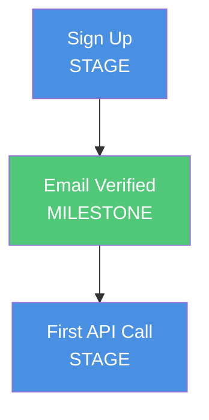
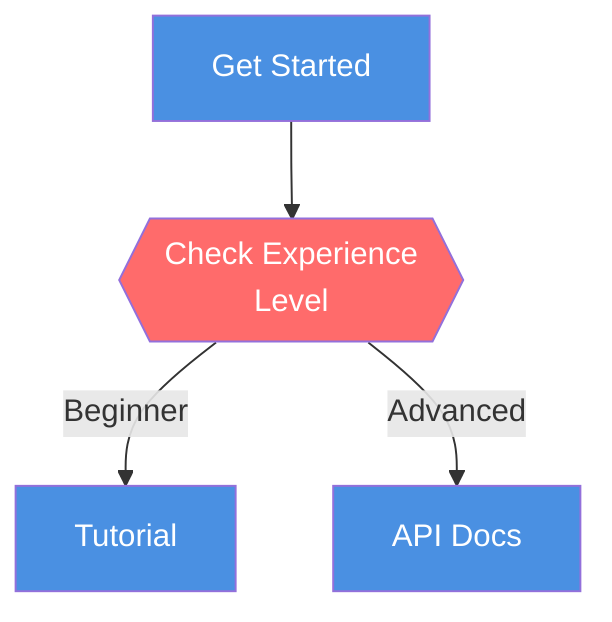
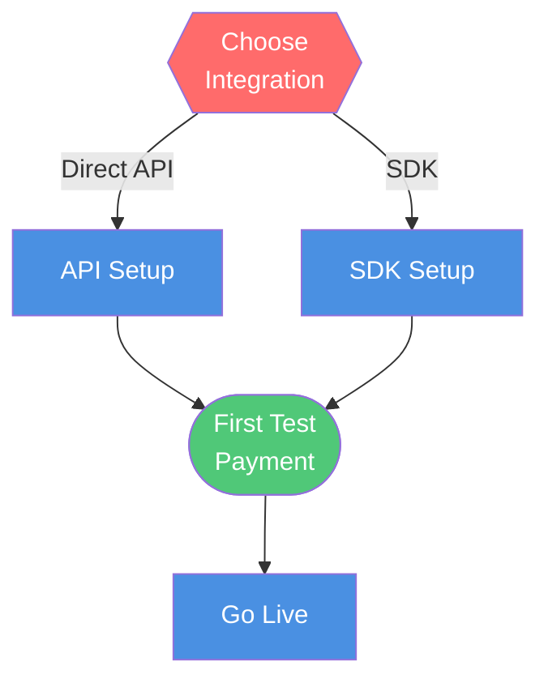
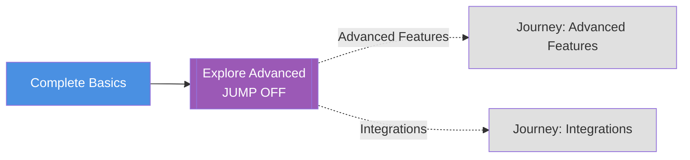
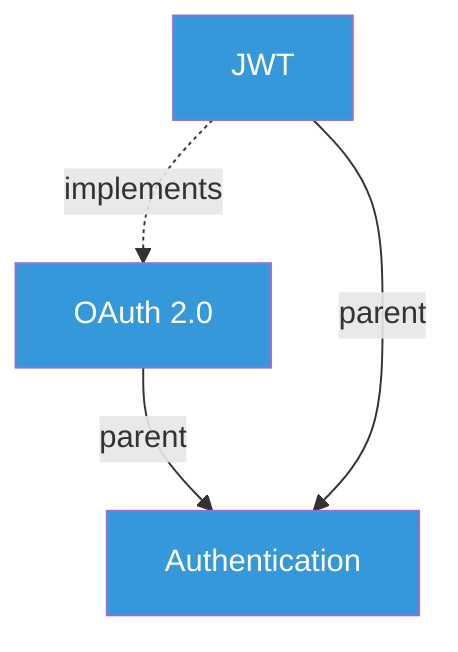
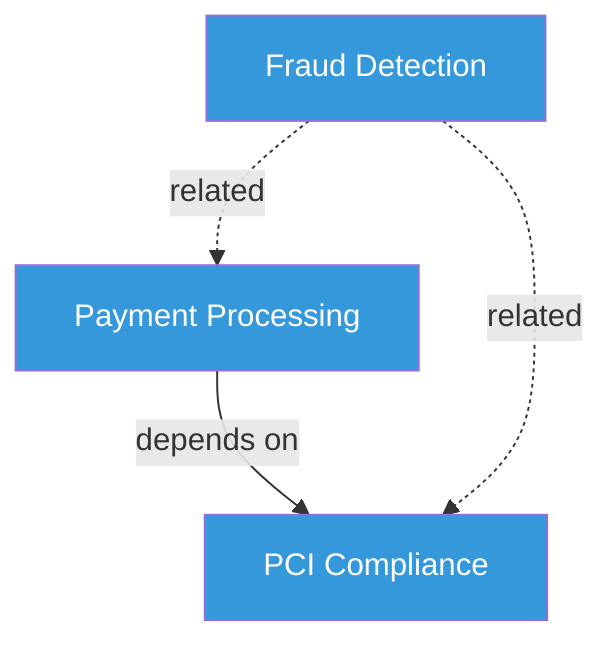
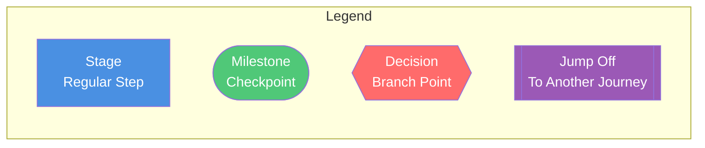

# Mermaid Graph Visualization Examples

**Version:** 1.0.0
**Status:** Draft

## Overview

Examples of rendering Semwerk journeys and concept graphs as Mermaid diagrams.

## Simple Linear Journey

### YAML

```yaml
journey:
  key: quickstart
  nodes:
    - id: signup
      type: stage
      key: signup
      name: "Sign Up"
      connections:
        - target_node_id: verify

    - id: verify
      type: milestone
      key: email-verified
      name: "Email Verified"
      connections:
        - target_node_id: first-call

    - id: first-call
      type: stage
      key: first-api-call
      name: "First API Call"
```

### Mermaid Diagram



## Branching Journey with Decision

### YAML

```yaml
journey:
  key: onboarding
  nodes:
    - id: start
      type: stage
      name: "Get Started"
      connections:
        - target_node_id: check-experience

    - id: check-experience
      type: decision
      name: "Check Experience Level"
      connections:
        - target_node_id: beginner-path
          label: "Beginner"
          condition: "experience == beginner"
        - target_node_id: advanced-path
          label: "Advanced"
          condition: "experience == advanced"

    - id: beginner-path
      type: stage
      name: "Tutorial"

    - id: advanced-path
      type: stage
      name: "API Docs"
```

### Mermaid Diagram



## Multi-Path Journey with Milestones

### YAML

```yaml
journey:
  key: payment-integration
  nodes:
    - id: choose-method
      type: decision
      name: "Choose Integration"
      connections:
        - target_node_id: api-path
          label: "Direct API"
        - target_node_id: sdk-path
          label: "SDK"

    - id: api-path
      type: stage
      name: "API Setup"
      connections:
        - target_node_id: test-payment

    - id: sdk-path
      type: stage
      name: "SDK Setup"
      connections:
        - target_node_id: test-payment

    - id: test-payment
      type: milestone
      name: "First Test Payment"
      connections:
        - target_node_id: production

    - id: production
      type: stage
      name: "Go Live"
```

### Mermaid Diagram



## Journey with Jump-Off

### YAML

```yaml
journey:
  key: basic-onboarding
  nodes:
    - id: complete-basics
      type: stage
      name: "Complete Basics"
      connections:
        - target_node_id: choose-next

    - id: choose-next
      type: jump_off
      name: "Explore Advanced"
      connections:
        - target_journey: journey:@jrn_advanced_features
          label: "Advanced Features"
        - target_journey: journey:@jrn_integrations
          label: "Integrations"
```

### Mermaid Diagram



## Concept Hierarchy

### YAML

```yaml
concepts:
  - id: cpt_authentication
    key: authentication
    name: "Authentication"

  - id: cpt_oauth
    key: oauth
    name: "OAuth 2.0"

  - id: cpt_jwt
    key: jwt
    name: "JWT"

relationships:
  - from: concept:@cpt_oauth
    to: concept:@cpt_authentication
    kind: parent

  - from: concept:@cpt_jwt
    to: concept:@cpt_authentication
    kind: parent

  - from: concept:@cpt_jwt
    to: concept:@cpt_oauth
    kind: implements
```

### Mermaid Diagram



## Concept Network

### YAML

```yaml
concepts:
  - id: cpt_payments
    key: payment-processing
    name: "Payment Processing"

  - id: cpt_fraud
    key: fraud-detection
    name: "Fraud Detection"

  - id: cpt_pci
    key: pci-compliance
    name: "PCI Compliance"

relationships:
  - from: concept:@cpt_payments
    to: concept:@cpt_pci
    kind: depends_on

  - from: concept:@cpt_fraud
    to: concept:@cpt_payments
    kind: related

  - from: concept:@cpt_fraud
    to: concept:@cpt_pci
    kind: related
```

### Mermaid Diagram



## Node Type Legend



## TypeScript Generator

```typescript
import { Journey } from '@semwerk/semspec';

function generateMermaid(journey: Journey): string {
  let mermaid = 'graph TD\n';

  // Add nodes
  for (const node of journey.nodes) {
    const shape = getNodeShape(node.type);
    mermaid += `    ${node.id}${shape.open}${node.name}${shape.close}\n`;
  }

  mermaid += '\n';

  // Add connections
  for (const node of journey.nodes) {
    for (const conn of node.connections) {
      const label = conn.label ? `|${conn.label}|` : '';
      if (conn.target_node_id) {
        mermaid += `    ${node.id} -->${label} ${conn.target_node_id}\n`;
      }
    }
  }

  // Add styling
  mermaid += '\n';
  mermaid += '    classDef stage fill:#4A90E2,color:#fff\n';
  mermaid += '    classDef milestone fill:#50C878,color:#fff\n';
  mermaid += '    classDef decision fill:#FF6B6B,color:#fff\n';

  return mermaid;
}

function getNodeShape(type: string) {
  switch (type) {
    case 'stage': return { open: '[', close: ']' };
    case 'milestone': return { open: '([', close: '])' };
    case 'decision': return { open: '{{', close: '}}' };
    case 'jump_off': return { open: '[[', close: ']]' };
    default: return { open: '[', close: ']' };
  }
}
```

## See Also

- [Journey Graph](../journey-graph.md) - Journey format specification
- [Node Types](../node-types.md) - Node type taxonomy
- [Concept Graph](../../concepts/concept-graph.md) - Concept graph format
